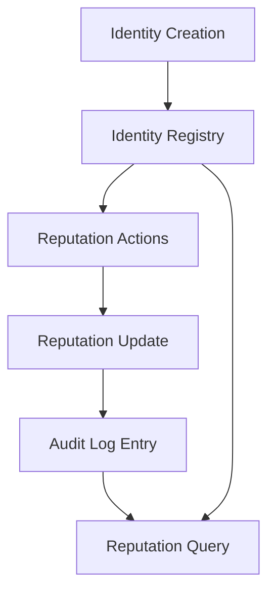

# TrustChain Protocol

**Decentralized Trust Scoring & Identity Framework for Bitcoin Layer 2 Ecosystem**

---

## Overview

The **TrustChain Protocol** introduces a decentralized, reputation-based trust scoring system purpose-built for participants in the Bitcoin Layer 2 ecosystem. By anchoring identity and reputation data on-chain via Clarity smart contracts, TrustChain enables **verifiable, portable, and censorship-resistant trust profiles**.

This protocol is designed to empower Lightning Network nodes, Bitcoin-backed DeFi protocols, decentralized exchanges, and P2P marketplaces with **transparent, immutable, and privacy-preserving reputation systems**—without relying on centralized authorities.

Key innovations include:

* **Decentralized Identity (DID) Registry** – Immutable identity mapping tied to trust data.
* **Dynamic Trust Decay** – Time-based reduction of reputation to enforce activity relevance.
* **Reputation Actions** – Configurable trust-earning activities with customizable scoring multipliers.
* **Cryptographic Audit Trail** – Full history of reputation events for accountability and verification.
* **Interoperability** – Designed for integration across Lightning Network, Stacks DeFi, and Bitcoin L2 systems.

---

## System Overview

At its core, TrustChain maintains a decentralized mapping between **principals (Stacks addresses)** and their **trust profiles**, which evolve based on recorded actions.

* **Identities**: Registered DIDs represent participants.
* **Reputation Scores**: Quantified metrics of reliability and trustworthiness.
* **Reputation Actions**: Activities that increase trust (e.g., successful Lightning routing, loan repayment).
* **Decay Mechanism**: Enforces freshness of trust data by gradually reducing scores if inactive.
* **Audit Trail**: Every trust change is logged immutably for transparency.

This enables participants to build a **portable trust profile** that can be referenced across any Bitcoin Layer 2 application.

---

## Contract Architecture

The protocol is implemented in **Clarity**, ensuring Bitcoin-anchored security and deterministic execution.

### Core Components

1. **Identity Registry (`identities` map)**

   * Stores DID, reputation score, creation time, last decay, and activity metadata.

2. **Reputation Actions (`reputation-actions` map)**

   * Configurable trust-generating actions with multipliers and descriptions.

3. **Reputation History (`reputation-history` map)**

   * Immutable log of all trust updates and decay events.

4. **Administrative Controls**

   * Owner functions to manage contract parameters (decay rate, reputation caps, etc.).

5. **Reputation Engine**

   * `update-reputation-score` – Adds points for verified actions.
   * `decay-reputation` – Applies trust decay based on elapsed block time.

---

## Data Flow

**Explanation**:

1. A user registers an identity with a DID.
2. Actions (e.g., Lightning routing success) trigger reputation updates.
3. Updates are logged in `reputation-history`.
4. Reputation scores are queried by other protocols to verify trust.

---

## Key Features

* **Trust Portability** – Reputation scores can be used across DeFi protocols, Lightning, and P2P trade.
* **Reputation Decay** – Prevents inactive identities from maintaining outdated trust scores.
* **Customizable Actions** – Protocols can define their own reputation-earning activities.
* **Auditability** – Every score change is transparent and verifiable on-chain.
* **User Sovereignty** – Trust data is controlled by users, not centralized intermediaries.

---

## Example Use Cases

* **Lightning Routing Nodes** – Reward uptime and reliability with measurable trust.
* **Bitcoin Lending Protocols** – Assess borrower reputation before issuing collateralized loans.
* **Decentralized Exchanges (DEXs)** – Enable traders to filter counterparties by trustworthiness.
* **Peer-to-Peer Marketplaces** – Eliminate reliance on centralized rating systems.

---

## Contract Parameters

| Parameter                     | Description                             | Default |
| ----------------------------- | --------------------------------------- | ------- |
| `MAX-REPUTATION-SCORE`        | Maximum attainable trust score          | `1000`  |
| `DEFAULT-STARTING-REPUTATION` | Initial score for new identities        | `50`    |
| `DECAY-RATE`                  | Percentage of trust decayed per cycle   | `10%`   |
| `DECAY-PERIOD`                | Block interval before decay is applied  | `10000` |
| `MINIMUM_DID_LENGTH`          | Minimum length of registered DID string | `5`     |

---

## Queries

* `get-reputation (owner)` → Current reputation score
* `get-full-identity (owner)` → Complete trust profile
* `verify-reputation (owner, threshold)` → Check if score ≥ threshold
* `get-reputation-action (action-type)` → Action configuration details
* `get-reputation-history (owner, tx-id)` → Retrieve past trust events
* `get-contract-parameters` → Current system configuration

---

## Security Considerations

* **Permissioned Admin Functions** – Only the contract owner can adjust core parameters.
* **Immutable Audit Trail** – Reputation changes cannot be deleted or modified.
* **Reputation Caps** – Prevents inflation beyond maximum score.
* **Action Whitelisting** – Only valid, active actions influence reputation.

---

## Future Extensions

* **Cross-Chain Reputation Proofs** – Export trust proofs to Lightning or other Bitcoin L2s.
* **Zero-Knowledge Reputation** – Private proofs of minimum trust thresholds.
* **Decentralized Governance** – Transition ownership from a single admin to DAO governance.

---

## License

MIT License – open for community adoption, extension, and integration into Bitcoin Layer 2 protocols.
